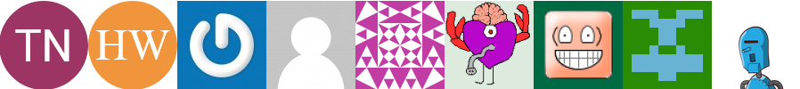

# Larvatar

[](https://github.com/renfordt/Larvatar)
[](https://packagist.org/packages/renfordt/larvatar/)


[](https://codeclimate.com/github/renfordt/larvatar/test_coverage)
[](https://codeclimate.com/github/renfordt/larvatar/maintainability)

Larvatar is a package that combines different avatar styles, like Gravatar, Initials Avatar.



## Installation

The recommended way of installing Larvatar is to use [Composer](https://getcomposer.org/). Run the following command to
install it to you project:
```
composer require renfordt/larvatar
```

## Usage

The general usage is simple. Create a new Larvatar class, insert name and email and the avatar type you wish.

```php
<?php
use Renfordt\Larvatar\Enum\LarvatarTypes;
use Renfordt\Larvatar\Larvatar;

$larvatar = new Larvatar('Test Name', 'test@test.com', LarvatarTypes::InitialsAvatar);
$larvatar->setFont('Roboto,sans-serif', './font/Roboto-bold.ttf');
echo $larvatar->getImageHTML();

// if you need base64 encryption, currently this works only for InitialsAvatar
echo $larvatar->getImageHTML('base64');
```

There are currently eight different types of avatars available:

```php
\Renfordt\Larvatar\Enum\LarvatarTypes::InitialsAvatar;  // Microsoft Teams like avatar with initials
\Renfordt\Larvatar\Enum\LarvatarTypes::Gravatar;        // Gravatar
\Renfordt\Larvatar\Enum\LarvatarTypes::mp;              // (Gravatar) MysticPerson, simple cartoon-style silhouette (default)
\Renfordt\Larvatar\Enum\LarvatarTypes::identicon;       // (Gravatar) A geometric pattern based on a email hash 
\Renfordt\Larvatar\Enum\LarvatarTypes::monsterid;       // (Gravatar) A generated monster different colors and faces
\Renfordt\Larvatar\Enum\LarvatarTypes::wavatar;         // (Gravatar) generated faces with differing features and backgrounds
\Renfordt\Larvatar\Enum\LarvatarTypes::retro;           // (Gravatar) 8-bit arcade-style pixelated faces
\Renfordt\Larvatar\Enum\LarvatarTypes::robohash;        // (Gravatar) A generated robot with different colors, faces, etc
```
